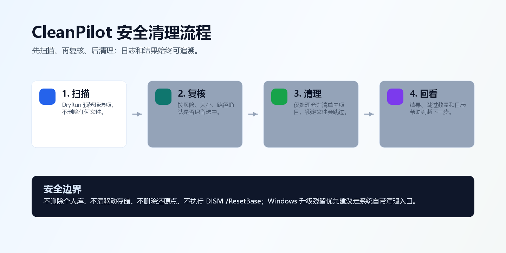
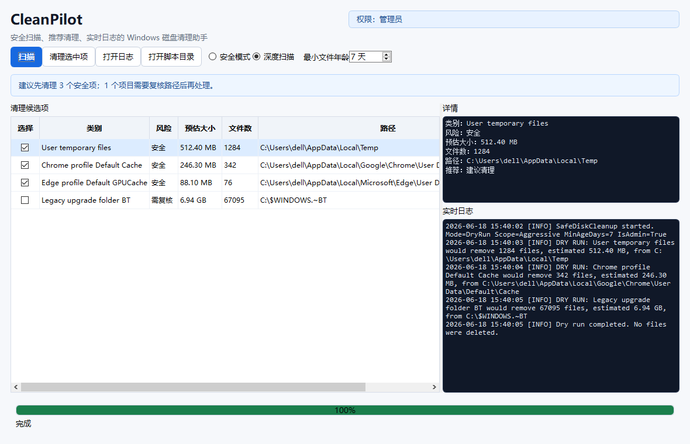
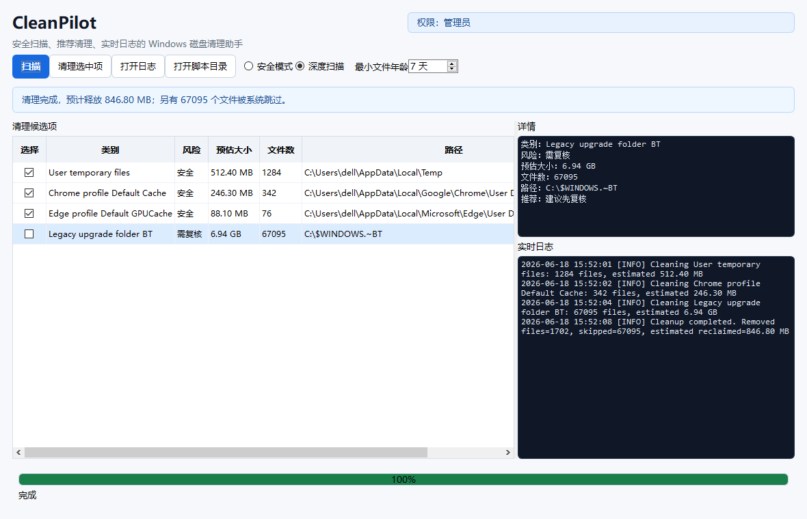

# CleanPilot

CleanPilot 是一款面向 Windows 10/11 的安全磁盘清理助手。它保留 PowerShell 命令行入口，同时提供 Qt 桌面端，用更直观的方式展示扫描结果、推荐信息、进度条、实时日志和清理后的反馈。

CleanPilot 的核心原则是先扫描、再复核、后清理。它只处理明确列入允许清单的缓存和维护目录；遇到锁定、受保护或不适合强制删除的文件时会跳过并记录日志，而不是冒险强删系统内容。



## 界面预览

扫描完成后，CleanPilot 会把候选项按类别、风险、预估大小、文件数和路径列出来，并在右侧展示详情与实时日志。



清理完成后，界面会展示实际释放空间、跳过文件数量和后续建议。类似 `$WINDOWS.~BT` 这类 Windows 升级残留如果被系统保护，CleanPilot 会明确显示跳过情况，不会误导为已释放空间。



## 直接运行

仓库已包含一个 Windows x64 one-folder 发布包，拉取后可以直接运行：

```text
dist\CleanPilot\CleanPilot.exe
```

注意：不要只单独复制 `CleanPilot.exe`。它依赖同级目录下的 `_internal` 运行库、Qt 组件和脚本文件，分发时需要保留完整的 `dist\CleanPilot` 目录。

如果需要管理员权限清理系统级缓存，可以右键以管理员身份运行 `CleanPilot.exe`，或使用命令行启动器：

```text
Run-SafeDiskCleanup-AsAdmin.cmd
```

## 安全边界

CleanPilot 默认采用保守策略：

- 先通过 `DryRun` 扫描预览，再决定是否执行清理。
- 只清理明确允许的缓存、临时文件和维护目录。
- 不删除个人库目录。
- 不清理驱动存储。
- 不删除系统还原点。
- 不执行 `DISM /ResetBase`。
- 遇到锁定文件、Windows 保护文件或权限不足时跳过并写入日志。
- Windows 升级残留目录，例如 `$WINDOWS.~BT`，优先建议通过 Windows 自带“存储/临时文件”入口处理。

本项目不会捆绑 WizTree 或其他专有磁盘分析工具。如果你想把 WizTree 作为可视化辅助工具，可以自行下载，并通过 `-WizTreePath` 传入路径。

## 桌面端功能

- 一键扫描和清理选中项。
- 安全模式与深度扫描模式。
- 最小文件年龄设置，降低误删近期文件的风险。
- 清理候选项表格，支持路径查看和风险复核。
- 实时进度条、推荐信息和日志面板。
- 清理后根据实际结果更新候选项与详情。
- 对未实际释放空间的情况给出明确提示。

## 命令行用法

预览清理候选项，不删除文件：

```powershell
powershell -NoProfile -ExecutionPolicy Bypass -File .\SafeDiskCleanup.ps1 -DryRun
```

预览更深入的开发者缓存和 Windows 升级残留清理：

```powershell
powershell -NoProfile -ExecutionPolicy Bypass -File .\SafeDiskCleanup.ps1 -DryRun -Aggressive -MinAgeDays 14
```

执行保守清理：

```powershell
powershell -NoProfile -ExecutionPolicy Bypass -File .\SafeDiskCleanup.ps1
```

可选执行 Windows 组件清理：

```powershell
powershell -NoProfile -ExecutionPolicy Bypass -File .\SafeDiskCleanup.ps1 -IncludeDism
```

## 当前可清理内容

- 用户临时文件。
- Windows 临时文件。
- Windows Update 下载缓存。
- 传递优化缓存。
- Windows 错误报告缓存。
- CBS 和 DISM 归档日志。
- Chrome、Edge 和 Firefox 用户缓存。
- 深度扫描模式下的 npm、Yarn、pip、NuGet 等开发者缓存。
- 深度扫描模式下的 Windows 升级残留候选项。
- 可选 DISM 组件清理。

## 从源码运行

安装桌面端依赖：

```powershell
python -m pip install PySide6
```

启动 Qt 桌面端：

```powershell
python -m src.cleanpilot_qt.app
```

## 打包发布

提前下载可打包依赖到本地 wheel 缓存：

```powershell
powershell -NoProfile -ExecutionPolicy Bypass -File .\scripts\download_qt_wheels.ps1
```

构建自包含 Windows 发布目录：

```powershell
powershell -NoProfile -ExecutionPolicy Bypass -File .\scripts\build_qt_app.ps1
```

构建完成后，发布目录位于：

```text
dist\CleanPilot
```

## 测试

```powershell
powershell -NoProfile -ExecutionPolicy Bypass -File .\tests\Test-SafeDiskCleanup.ps1
python -m unittest tests.test_qt_engine tests.test_qt_ui_contract -v
```

## 路线图

- 为 UI 集成提供更完整的 JSON Lines 引擎输出。
- 提供稳定的清理目标 ID，并支持按目标选择清理。
- 完善桌面端的结构化进度、风险标签和最终清理报告。
- 发布更正式的 Windows x64 安装包。

## 许可证

MIT。参见 [LICENSE](LICENSE)。
